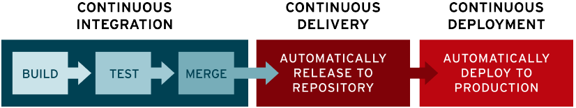

# CI/CD
Estos son términos, o más bien acrónimos, muy empleados hoy en día en el desarrollo del software.

Estos significan: *Continous Integration* (Integración Continua) y *Continous Deployment* (Despliegue Continuo).

Estas relacionados con lo que se conoce como **Desarrollo Ágil** o *Agile Development* en el que se sigue un ciclo "infinito" en el que se planea el software, se desarrolla, se prueba y, si pasa las pruebas y cumple una serie de requisitos, se mezcla en la rama principal y se crea una nueva versión o *release*.

Aquí tienes una imagen obtenida en la web de [Red Hat](https://www.redhat.com/en/topics/devops/what-is-ci-cd) donde se describe, en una imagen, el proceso y pasos que se llevan en CI/CD:

En esta otra imagen se representa el proceso "infinito" de CI/CD, imagen obtenida en [la siguiente web](https://www.synopsys.com/glossary/what-is-cicd.html):

