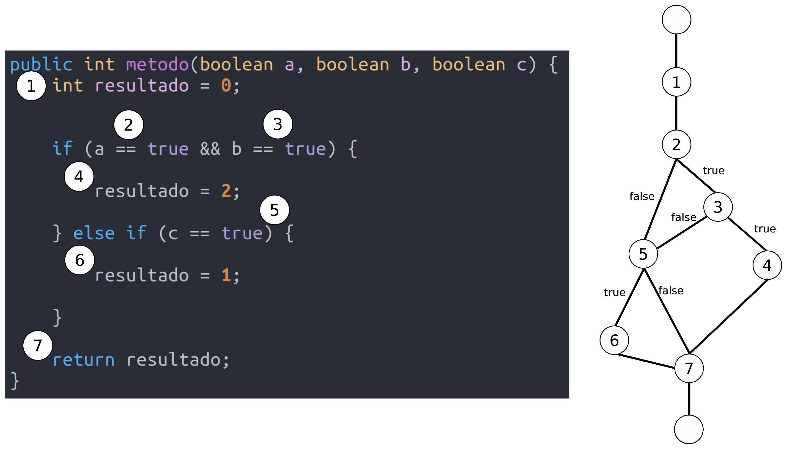

# Planificación de pruebas: enfoque de caja blanca
Desde un **enfoque de caja blanca**, el código interno de una unidad de código, los podemos transformar en un **grafo de posibles caminos** que nos facilitará la labor de conseguir una buena cobertura de pruebas.

Veámoslo con un ejemplo. Dado el siguiente código en Java, que consta de 6 sentencias:

```java
public int metodo(boolean a, boolean b, boolean c) {
    int resultado = 0;

    if (a == true && b == true) {
        resultado = 2;
    } else if (c == true) {
        resultado = 1;
    }

    return resultado;
}
```

El grafo de posibles caminos sería el siguiente:



Así, tendrías que diseñar pruebas, con las entradas oportunas, para que, al menos, se pase por todos los caminos del grafo una vez. Aquí tienes un posible plan de pruebas para lograrlo:

<table>
	<tr>
		<th colspan="2">Descripción</th>
	</tr>
	<tr>
		<td colspan="2">
			Probar el método "metodo" que recibe tres booleanos
		</td>
	</tr>
	<tr>
		<th colspan="2">Condiciones de ejecución</th>
	</tr>
	<tr>
		<td colspan="2">
			No existen condiciones de ejecución para probar este método
		</td>
	</tr>
	<tr>
		<th>Entrada</th>
		<th>Salida</th>
	</tr>
	<tr>
		<td>
			a = false<br>
			b = true<br>
			c = true
		</td>
		<td>
			 1
		</td>
		<td>
			a = false<br>
			b = true<br>
			c = false
		</td>
		<td>
			 0
		</td>
		<td>
			a = true<br>
			b = false<br>
			c = true
		</td>
		<td>
			 1
		</td>
		<td>
			a = true<br>
			b = false<br>
			c = false
		</td>
		<td>
			 0
		</td>
		<td>
			a = true<br>
			b = true<br>
			c = true 
		</td>
		<td>
			2
		</td>
	</tr>
</table>

# Limitaciones
Lograr una buena cobertura con pruebas de caja blanca es un objetivo deseable; pero no suficiente a todos los efectos. Un programa puede estar perfecto en todos sus términos, y sin embargo no servir a la función que se pretende.

Por ejemplo, un Rolls-Royce es un coche que sin duda pasaría las pruebas más exigentes sobre los últimos detalles de su mecánica o su carrocería. Sin embargo, si el cliente desea un todo-terreno, difícilmente va a comprárselo.

Otro ejemplo, si escribimos una rutina para ordenar datos por orden ascendente, pero el cliente los necesita en orden decreciente; no hay prueba de caja blanca capaz de detectar el error.

Las pruebas de caja blanca nos convencen de que un programa hace bien lo que hace; pero no de que haga lo que necesitamos.

Además, y por último, si el código cambia o se refactoriza las pruebas que hemos planificado siguiendo este enfoque ya no tendrían sentido y habría que cambiarlas.

# Ejercicio
Puedes poner a prueba lo aprendido intentando hacer lo propio con este programa en Java que pide por teclado al usuario un número mayor que cero y par, verificando que así sea con un mensaje de respuesta:

```java
package es.rgmf.numeroprimo;

import java.util.Scanner;

public class NumeroPar {
    public static void main(String[] args) {
        Scanner entrada = new Scanner(System.in);
        int numero;
        String datoLeido;

        try {
            System.out.print("Introduce un número entero mayor que cero y par: ");
            datoLeido = entrada.nextLine();
            numero = Integer.parseInt(datoLeido);

            if (numero > 0 && numero % 2 == 0) {
               System.out.println("El número " + numero + " es mayor que cero y par");
            } else {
               System.out.println("El número " + numero + " NO es mayor que cero y par");
            }
         } catch (NumberFormatException error) {
            System.out.println("El valor introducido no es un número entero");
         }
    }
}
```
